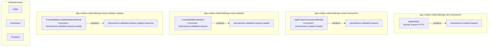
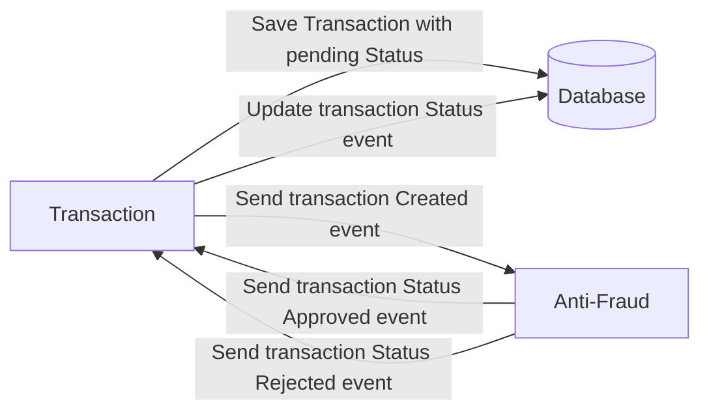

# README 2: Documentación Técnica y de Uso

## Lógica Aplicada y Consideraciones Técnicas

En este reto se trabajó con un **patrón event-driven**, utilizando **NestJS** como framework principal y **Prisma** para el acceso a base de datos. Se utilizó **Redpanda Console** para monitorear en tiempo real los topics y mensajes en Kafka.

Por temas de tiempo no se implementaron pruebas unitarias ni se añadió caching con Redis en el servicio GET. Esto último hubiera sido ideal para evitar consultar la base de datos en transacciones que ya estén en estado `rejected` o `approved`, mejorando el rendimiento y aliviando la carga en la base de datos.

No se implemento logica para dql si esta el bloque pero no se adiciono dado que se iba a llenar esos topicos sin consumidores, como no plantie usos para los topicos DQL no aplique esfuersos para ese punto.

Sobre la escalabilidad automática (autoescalado) de consumidores y productores, no se implementó en esta ocasión, pero en entornos productivos y críticos, como AWS, es una práctica común. Por ejemplo, en AWS es habitual diseñar alertas que monitoricen el throughput de Kafka y, basándose en esas métricas, escalen dinámicamente la cantidad de instancias de consumidores para mantener un rendimiento óptimo. Este enfoque permite armar un stack básico robusto de autoescalado en plataformas cloud.

Finalmente, una mejora que hubiera aportado mucho valor es la integración de trazabilidad distribuida mediante **OpenTelemetry** con instrumentación para Kafka. Esto permitiría tener una visión completa y agradable de las trazas end-to-end.


## Descripción General

Este repositorio implementa un microservicio de transacciones financieras con validación antifraude, usando Node.js (NestJS), Kafka y PostgreSQL. El flujo principal es:

1. Se crea una transacción (`pending`).
2. Se envía un evento a un microservicio antifraude.
3. El antifraude responde con un evento de aprobación o rechazo.
4. Se actualiza el estado de la transacción en la base de datos.

## Estructura del Proyecto

- `src/` — Código fuente principal, organizado por módulos:
  - `transaction/` — Lógica de creación y gestión de transacciones.
  - `antifraude/` — Lógica de validación antifraude.
- `prisma/` — Esquema y migraciones de base de datos.
- `libs/` — Librerías compartidas.
- `scripts/` — Scripts auxiliares (ej: creación de topics Kafka).
- `docker-compose.yml` — Orquestación de servicios para desarrollo local.
- `dockerfile` — Imagen Docker del microservicio.

## Uso de Docker

# API Endpoints

## Crear Transacción

- **URL:** `http://localhost:3000/transactions`
- **Método:** `POST`
- **Content-Type:** `application/json`
- **Descripción:** Crea una nueva transacción con los datos proporcionados.

### Request Body

```json
{
  "accountExternalIdDebit": "3f8d2a57-9cde-4f6b-8fbb-234b59a17d2a",
  "accountExternalIdCredit": "a72d4b86-1f9a-4b5a-8c6d-7f9e2c3a1b4e",
  "tranferTypeId": 1,
  "value": 1500
}
{
  "message": "Transaccion",
  "data": {
    "status": "Transacción creada correctamente",
    "transactionId": "a908a729-64cf-40ff-945a-df9a045357a3"
  }
}

```
- **URL:** `http://localhost:3000/transactions/{transactionId}`
- **Método:** `GET`
- **Content-Type:** `application/json`
- **Descripción:** Obtiene una transaccion por ID generado

### Request Body

```json
{
  "transactionExternalId": "a908a729-64cf-40ff-945a-df9a045357a3",
  "transactionType": {
    "name": "1"
  },
  "transactionStatus": {
    "name": "rejected"
  },
  "value": 1500,
  "createdAt": "2025-08-11T15:45:31.008Z"
}
```


### docker-compose.yml

Incluye los servicios:
- **postgres**: Base de datos PostgreSQL (puerto 5432).
- **zookeeper**: Servicio requerido por Kafka.
- **kafka**: Broker de Kafka (puerto 9092).
- **redpanda-console**: Interfaz web para monitorear y administrar los topics y mensajes de Kafka.
- **app-nodejs-codechallenge-emit-transaction**: Servicio que expone el endpoint HTTP y produce el evento inicial de creación de transacción.
- **app-nodejs-codechallenge-create-transaction**: Servicio que consume el evento de creación, hace insercion y produce el evento de validación antifraude.
- **app-nodejs-codechallenge-fraud-validator**: Servicio que consume el evento de validación rquest , aplica logica  y produce el evento de actualización de estado antifraude.
- **app-nodejs-codechallenge-fraud-validator-update**: Servicio que consume el evento de actualización y produce la respuesta final de validación(no se implemento consumer final este punto dado que no me dio tiempo para ponerme creativo).
- **app-nodejs-codechallenge-nginx-1**: Nxing para manejar 3 producers en emit transaccion
Levantar todos los servicios:
```bash
docker-compose up
```

### dockerfile

Construye la imagen del microservicio:
- Usa Node 20 Alpine.
- Instala dependencias y genera Prisma Client.
- Compila el proyecto y ejecuta los microservicios

Eejecutar este script para levantar todos los servicios:
```bash
docker compose up --build -d
```

## Scripts Principales (`package.json`)

- `start:emit-transaction`: Emite eventos de creación de transacción.
- `start:create-transaction`: Crea transacciones en la base de datos.
- `start:fraud-validator`: Servicio de validación antifraude.
- `start:fraud-validator-update`: Servicio de actualización antifraude.
- `start:dev`: Modo desarrollo con hot-reload.
- `start:load-pressure-test`: Realiza prueba de mucha solicitudes concurrentes..

## Stack Tecnológico

- **Node.js/NestJS**: Framework principal.
- **Prisma**: ORM para PostgreSQL.
- **Kafka**: Mensajería de eventos.
- **PostgreSQL**: Base de datos.
- **Redpanda Console**: UI para Kafka.
- **Nginx**: Para manejar la api

## Notas

- El proyecto ignora las carpetas `node_modules` y `dist`.
- Configura las variables de entorno en `.env` para desarrollo local.
- El flujo de eventos y estados está documentado en el README original y en el diagrama Mermaid.

---

# Arquitectura de Topics y Servicios (Kafka)



**Contenedores:**
- `app-nodejs-codechallenge-emit-transaction`: expone el endpoint HTTP y produce el evento inicial.
- `app-nodejs-codechallenge-create-transaction`: consume el evento de creación y produce el de validación.
- `app-nodejs-codechallenge-fraud-validator`: consume el evento de validación y produce el de actualización de estado.
- `app-nodejs-codechallenge-fraud-validator-update`: consume el evento de actualización y produce la respuesta final.
- `app-nodejs-codechallenge-kafka-1`, `app-nodejs-codechallenge-zookeeper-1`, `app-nodejs-codechallenge-postgres-1`: infraestructura de mensajería y base de datos.

**Flujo resumido:**
1. `AppModule` (`app-nodejs-codechallenge-emit-transaction`) recibe la petición y produce el evento `transactions.created.request`.
2. `AppCreateTransactionModule` (`app-nodejs-codechallenge-create-transaction`) consume ese evento y produce `transactions.validated.request`.
3. `FraudValidationModule` (`app-nodejs-codechallenge-fraud-validator`) consume ese evento y produce `transactions.validated.request.update`.
4. `FraudValidationUpdateStatusModule` (`app-nodejs-codechallenge-fraud-validator-update`) consume ese evento y produce `transactions.validated.request.update.response`.

---


# Yape Code Challenge :rocket:

Our code challenge will let you marvel us with your Jedi coding skills :smile:. 

Don't forget that the proper way to submit your work is to fork the repo and create a PR :wink: ... have fun !!

- [Problem](#problem)
- [Tech Stack](#tech_stack)
- [Send us your challenge](#send_us_your_challenge)

# Problem

Every time a financial transaction is created it must be validated by our anti-fraud microservice and then the same service sends a message back to update the transaction status.
For now, we have only three transaction statuses:

<ol>
  <li>pending</li>
  <li>approved</li>
  <li>rejected</li>  
</ol>

Every transaction with a value greater than 1000 should be rejected.



# Tech Stack

<ol>
  <li>Node. You can use any framework you want (i.e. Nestjs with an ORM like TypeOrm or Prisma) </li>
  <li>Any database</li>
  <li>Kafka</li>    
</ol>

We do provide a `Dockerfile` to help you get started with a dev environment.

You must have two resources:

1. Resource to create a transaction that must containt:

```json
{
  "accountExternalIdDebit": "Guid",
  "accountExternalIdCredit": "Guid",
  "tranferTypeId": 1,
  "value": 120
}
```

2. Resource to retrieve a transaction

```json
{
  "transactionExternalId": "Guid",
  "transactionType": {
    "name": ""
  },
  "transactionStatus": {
    "name": ""
  },
  "value": 120,
  "createdAt": "Date"
}
```

## Optional

You can use any approach to store transaction data but you should consider that we may deal with high volume scenarios where we have a huge amount of writes and reads for the same data at the same time. How would you tackle this requirement?

You can use Graphql;

# Send us your challenge

When you finish your challenge, after forking a repository, you **must** open a pull request to our repository. There are no limitations to the implementation, you can follow the programming paradigm, modularization, and style that you feel is the most appropriate solution.

If you have any questions, please let us know.
